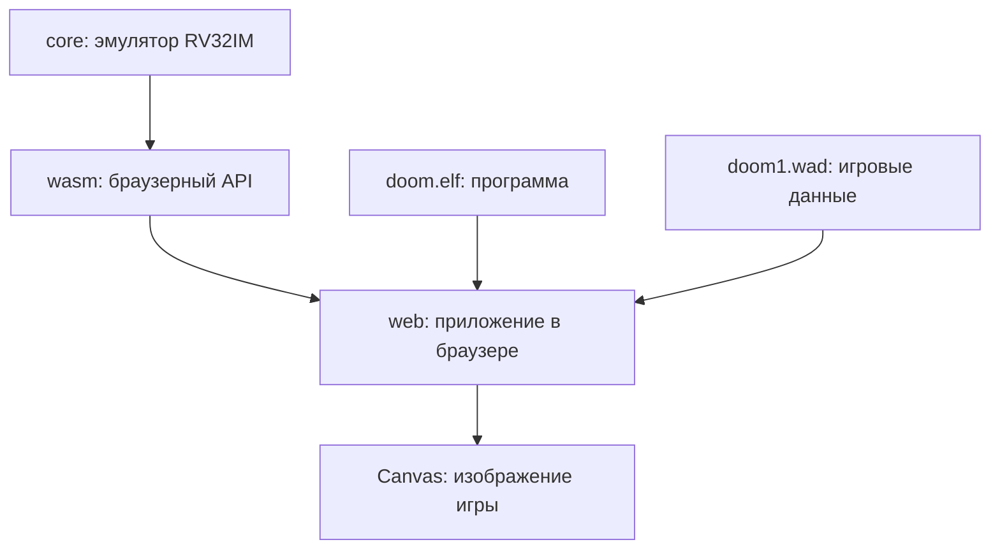

# RISC-V RV32IM emulator

Эмулятор RV32IM на Rust, работающий в браузере через WebAssembly. Проект загружает ELF32 RISC-V, исполняет Doom Generic и выводит framebuffer 640×400 на HTML Canvas. Термин RV32IM обозначает конкретную конфигурацию архитектуры набора команд (ISA) [RISC-V](https://en.wikipedia.org/wiki/RISC-V) с открытым исходным кодом. 

Создан создан через вайбкодинг с [codex](https://openai.com/codex/) как эксперимент

## Документация

- [Устройство ядра эмулятора](docs/core.md)
- [Сборка WASM и взаимодействие с Web](docs/wasm.md)
- [Происхождение и сборка Doom ELF и WAD](docs/about.md)

## Структура проекта

```text
.
├── core/                # универсальное ядро RV32IM
├── wasm/                # WASM API и DoomHost
├── web/                 # frontend, ELF, WAD и собранный WASM
├── docs/                # подробная документация
└── .github/workflows/   # GitHub Pages deployment
```

## Архитектура и связи компонентов



`core` — независимое от браузера ядро эмулятора. Оно реализует процессор RV32IM, память, загрузчик ELF и общий интерфейс `Host`. Пакет `wasm` подключает `core` как Rust-зависимость, добавляет браузерный API `WasmRiscv` и реализацию `DoomHost`, через которую Doom получает WAD, время и платформенные системные вызовы. `wasm-pack` компилирует оба Rust-пакета в один WASM-модуль и создаёт JavaScript bindings в `web/pkg`.

`doom.elf` не компилируется в WebAssembly и не становится частью `core`. Это отдельная гостевая программа для архитектуры RISC-V. Браузер загружает файл через `fetch()`, а `load_elf()` разбирает ELF-заголовки, копирует сегменты `PT_LOAD` в гостевую память и устанавливает точку входа процессора. Затем каждый кадр frontend вызывает `run()`: ядро читает и исполняет инструкции Doom из гостевой памяти, `DoomHost` обслуживает обращения к `doom1.wad`, а готовый framebuffer копируется на Canvas.

При запуске страница загружает `doom.elf` и `doom1.wad`, передаёт их WASM-модулю, а затем регулярно вызывает эмулятор. Полученный framebuffer отображается на Canvas.

## Проверка Rust workspace

```sh
cargo test --workspace
cargo build --workspace
cargo clippy --workspace --all-targets -- -D warnings
```

## Сборка WebAssembly

Нужны Rust, `wasm32-unknown-unknown` и `wasm-pack`:

```sh
rustup target add wasm32-unknown-unknown
cargo install wasm-pack

cd wasm
wasm-pack build --target web --release --out-dir ../web/pkg
```

## Локальный запуск

```sh
cd web
python3 -m http.server 8080
```

Откройте [http://localhost:8080](http://localhost:8080) и нажмите «Load doom.elf».

Для запуска нужны файлы:

```text
web/doom.elf
web/doom1.wad
web/pkg/riscv_emu_wasm.js
web/pkg/riscv_emu_wasm_bg.wasm
```

В `doom1.wad` используется свободный Freedoom Phase 2. Оригинальные коммерческие WAD Doom в проект не включены.

## Возможности

- инструкции RV32I и расширение M;
- 8 MiB гостевой DRAM;
- ELF32 loader с поддержкой `PT_LOAD` и BSS;
- low и high alias памяти для rvcore и обычного bare-metal кода;
- MMIO UART, клавиатуры, таймера и framebuffer;
- платформенный интерфейс `Host` для системных вызовов;
- Doom ABI и виртуальный WAD на стороне WASM, без зависимости ядра от игры;
- браузерный ввод с клавиатуры;
- встроенные показатели MIPS, FPS и времени этапов кадра;
- автоматический деплой папки `web` в GitHub Pages.

## Ограничения

Не реализованы MMU, Linux, прерывания, расширения A/C/F/D/V, звук и сохранения. CSR представлены только внутренними счётчиками. Неподдержанная инструкция или ошибочный доступ к памяти возвращают явную ловушку.
